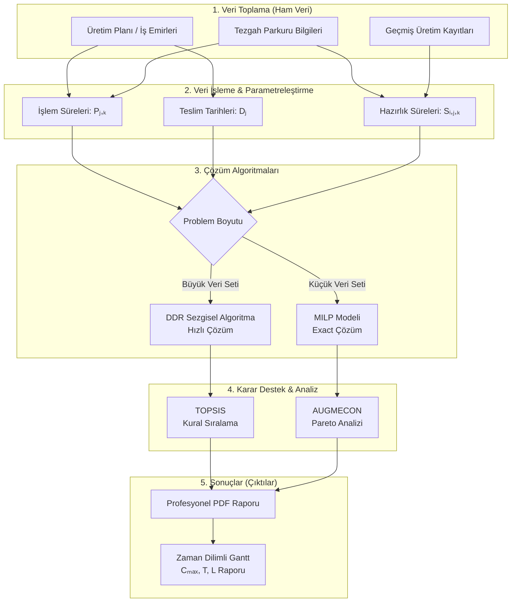
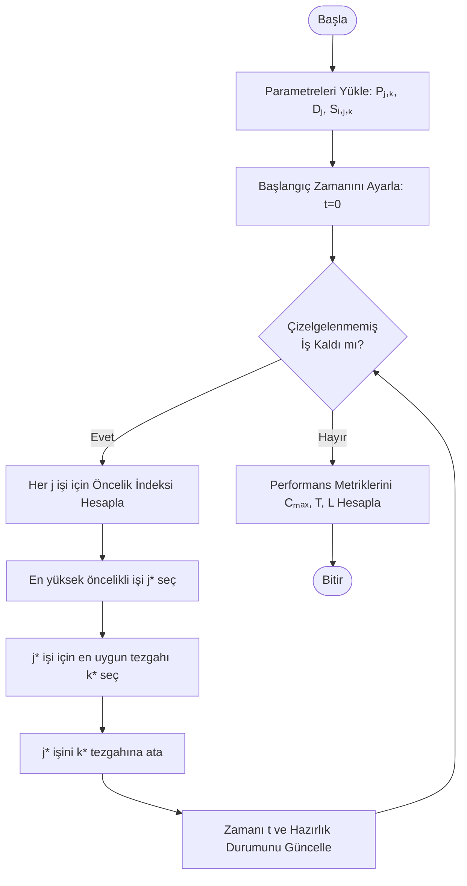
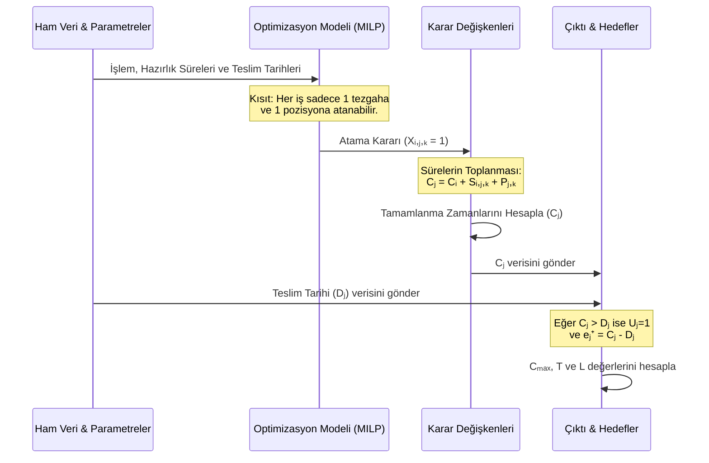

# Uygulamanın Teorik Veri ve İşlem Akışı

Bu belgede, ilişkisiz paralel tezgah çizelgeleme (UPMSP) probleminin çözümüne yönelik uygulamanın teorik akışı ele alınmaktadır. Verinin sahadan toplanması, algoritma parametrelerine dönüşümü ve nihai sonuçlara ulaşılması bir bütün halinde gösterilmektedir.

## 1. Genel Sistem ve Veri Akış Mimarisi (Makro Akış)

Uygulamanın genel veri akışı aşağıdaki şemada gösterilmektedir. Sahadan toplanan ham veriler, öncelikle matematiksel modele uygun parametrelere dönüştürülür, ardından çözüm yöntemine sokulur ve son olarak performans metrikleri elde edilir.



## 2. Sabitler, Parametreler ve Değişkenler Sözlüğü

Uygulamanın çalışması için gerekli olan girdiler ile karar değişkenleri aşağıdaki tabloda özetlenmiştir.

### Parametreler ve Sabitler (Girdiler)
| Sembol | Tür | Açıklama | Kaynak / Elde Ediliş |
|--------|-----|----------|----------------------|
| N | Sabit | Toplam iş (sipariş) sayısı | ERP/Üretim planlama modülü |
| M | Sabit | Toplam tezgah sayısı | Sahadaki kullanılabilir tezgahlar |
| Pⱼ,ₖ | Parametre | j işinin k tezgahındaki işlem süresi | İşin miktarı / Tezgah üretim hızı |
| Sᵢ,ⱼ,ₖ | Parametre | k tezgahında i işinden sonra j işi için hazırlık süresi | Tezgah kalıp değiştirme/temizlik süreleri veri tabanı |
| Dⱼ | Parametre | j işinin teslim tarihi | Müşteri sipariş sözleşmesi |

### Karar Değişkenleri ve Ara Değerler
| Sembol | Tür | Açıklama |
|--------|-----|----------|
| Xᵢ,ⱼ,ₖ| İkili (0/1) | k tezgahında i işinden hemen sonra j işi yapılıyorsa 1, aksi halde 0 |
| Cⱼ | Sürekli | j işinin tamamlanma zamanı (Cⱼ ≥ 0) |
| Uⱼ | İkili (0/1) | j işi gecikiyorsa 1, aksi halde 0 |
| eⱼ⁺ | Sürekli | j işinin gecikme miktarı (max(0, Cⱼ - Dⱼ)) |

## 3. Algoritma Akış Şeması (Karar Mekanizması)

Özellikle büyük boyutlu problemlerin hızlı çözümü için makalede önerilen **DDR (Dinamik Dağıtım Kuralı)** sezgiselinin adım adım mantıksal akışı aşağıda gösterilmiştir:



## 4. Matematiksel Dönüşümler (Süreç Entegrasyonu)

Yukarıdaki değişkenlerin birbiriyle nasıl etkileşime girdiğini ve sonuçları (çıktıları) nasıl tetiklediğini gösteren süreç akışı:



### Algoritmik İlişkilerin Formül Özeti:

1. **Zaman Akışı:** k tezgahında i işinden sonra j işi geliyorsa (Xᵢ,ⱼ,ₖ=1), j'nin bitiş zamanı şöyledir:
   Cⱼ ≥ Cᵢ + Sᵢ,ⱼ,ₖ + Pⱼ,ₖ
2. **Gecikme Tespiti:** İşin bitiş zamanı (Cⱼ) teslim tarihinden (Dⱼ) büyükse iş gecikmiştir:
   eⱼ⁺ ≥ Cⱼ - Dⱼ
   Eğer eⱼ⁺ > 0 ⟹ Uⱼ = 1
3. **Optimizasyon:** Amaç fonksiyonları olan maksimum tamamlanma süresi (Cₘₐₓ), toplam gecikme süresi (T = Σ eⱼ⁺) ve geciken iş sayısı (L = Σ Uⱼ) eş zamanlı minimize edilir (AUGMECON metodu ile).

---

## 5. Metin Tabanlı (ASCII) Akış Şemaları

Mermaid diyagramlarının desteklenmediği ortamlar veya düz metin okumaları için sürecin metin tabanlı (kutu) diyagram özetleri aşağıdadır:

### 5.1. Makro Veri Akışı

```text
+---------------------+     +-----------------------+     +--------------------+
|  1. HAM VERİLER     |     |  2. PARAMETRELER      |     |  3. ÇÖZÜM MOTORLARI|
|---------------------|     |-----------------------|     |--------------------|
| - Üretim Planı      |     | - İşlem Süreleri (P)  |     | - MILP (SCIP/SAT)  |
| - Tezgah Bilgileri  | --> | - Teslim Tarihleri (D)| --> | - DDR Sezgiselleri |
| - Geçmiş Kayıtlar   |     | - Hazırlık Süreleri(S)|     | (39 Konfigürasyon) |
+---------------------+     +-----------------------+     +---------+----------+
                                                                    |
                                                                    v
+---------------------+     +-----------------------+     +--------------------+
|  5. RAPORLAMA       |     |  4. KARAR DESTEK      |     |  SONUÇLAR          |
|---------------------|     |-----------------------|     |--------------------|
| - Zaman Dilimli     | <---| - TOPSIS Ranking      | <---| - Cmax, T, L       |
|   Gantt Şeması      |     | - Pareto Analizi      |     | - Çizelge (X, C)   |
| - Profesyonel PDF   |     |   (AUGMECON)          |     |                    |
+---------------------+     +-----------------------+     +--------------------+
```

### 5.2. DDR Algoritma Akışı

```text
          [ BAŞLA ]
              |
              v
+-----------------------------+
| Parametreleri Yükle (P,D,S) |
+-----------------------------+
              |
              v
+-----------------------------+
| Zamanı Ayarla (t=0)         |
+-----------------------------+
              |
              v
+-----------------------------+                 +-----------------------------+
| Çizelgelenmemiş İş Var mı?  | ---(HAYIR)--->  | Performans Metriklerini     |
+-----------------------------+                 | Hesapla (Cmax, T, L)        |
              |                                 +-----------------------------+
           (EVET)                                             |
              |                                               v
              v                                           [ BİTİR ]
+-----------------------------+
| Her j işi için Öncelik      |
| İndeksi Hesapla             |
+-----------------------------+
              |
              v
+-----------------------------+
| En yüksek öncelikli j* seç  |
+-----------------------------+
              |
              v
+-----------------------------+
| j* için en uygun k* tezgahı|
| seç ve ata                  |
+-----------------------------+
              |
              v
+-----------------------------+
| Zamanı ve Durumu Güncelle   |
+-----------------------------+
              |
              +--------------------------------(Döngü Başına Dön)
```
