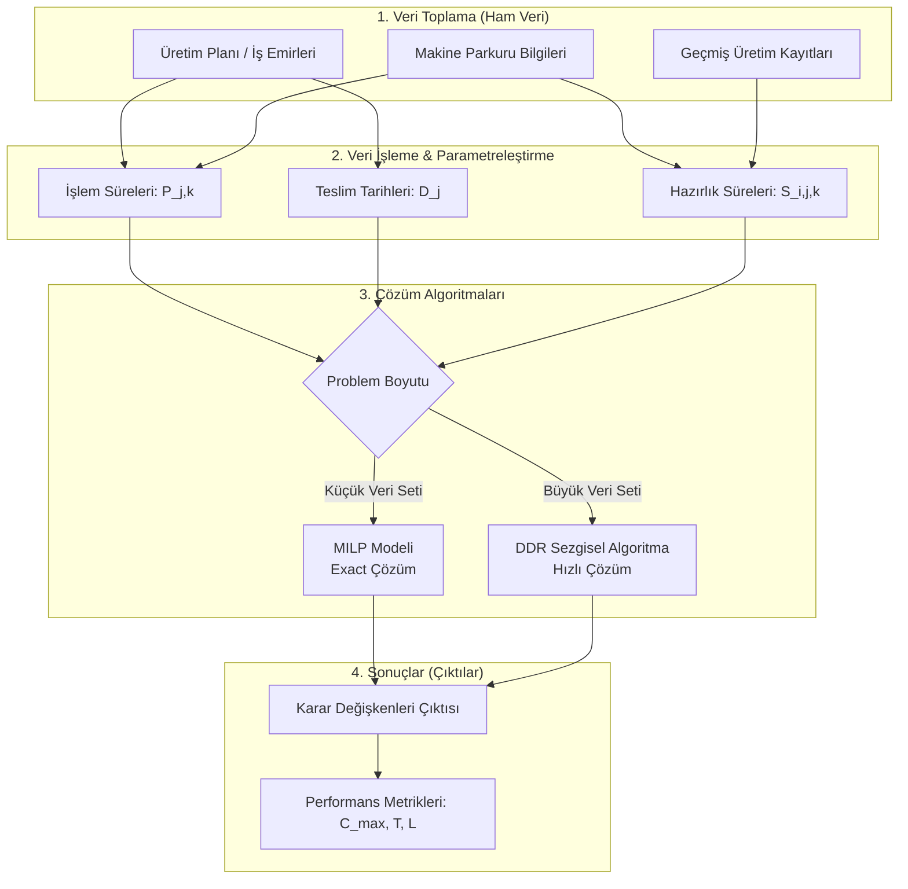
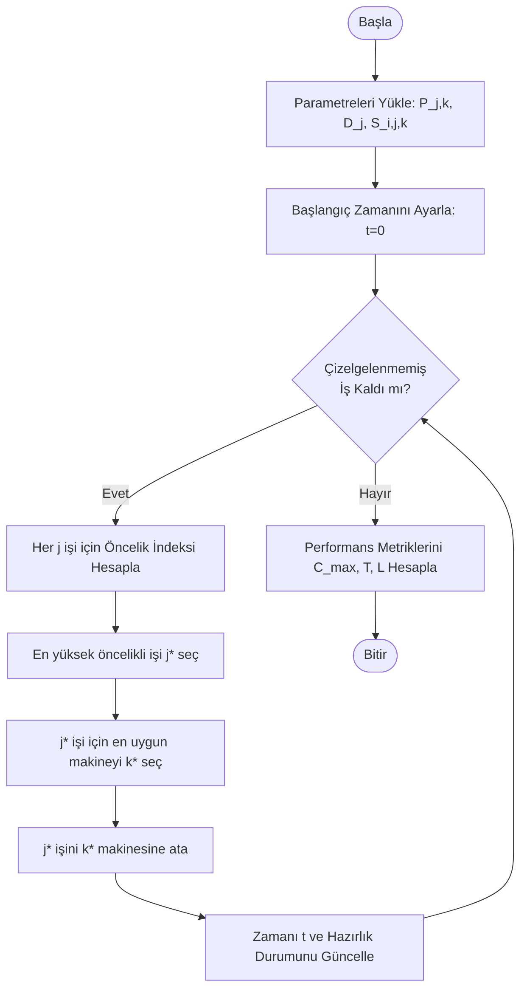

# Uygulamanın Teorik Veri ve İşlem Akışı

Bu belgede, eşisiz paralel makine çizelgeleme (UPMSP) probleminin çözümüne yönelik uygulamanın teorik akışı ele alınmaktadır. Verinin sahadan toplanması, algoritma parametrelerine dönüşümü ve nihai sonuçlara ulaşılması bir bütün halinde gösterilmektedir.

## 1. Genel Sistem ve Veri Akış Mimarisi (Makro Akış)

Uygulamanın genel veri akışı aşağıdaki şemada gösterilmektedir. Sahadan toplanan ham veriler, öncelikle matematiksel modele uygun parametrelere dönüştürülür, ardından çözüm yöntemine sokulur ve son olarak performans metrikleri elde edilir.



## 2. Sabitler, Parametreler ve Değişkenler Sözlüğü

Uygulamanın çalışması için gerekli olan girdiler ile karar değişkenleri aşağıdaki tabloda özetlenmiştir.

### Parametreler ve Sabitler (Girdiler)
| Sembol | Tür | Açıklama | Kaynak / Elde Ediliş |
|--------|-----|----------|----------------------|
| $N$ | Sabit | Toplam iş (sipariş) sayısı | ERP/Üretim planlama modülü |
| $M$ | Sabit | Toplam makine sayısı | Sahadaki kullanılabilir makineler |
| $P_{j,k}$ | Parametre | $j$ işinin $k$ makinesindeki işlem süresi | İşin miktarı / Makine üretim hızı |
| $S_{i,j,k}$ | Parametre | $k$ makinesinde $i$ işinden sonra $j$ işi için hazırlık süresi | Makine kalıp değiştirme/temizlik süreleri veri tabanı |
| $D_j$ | Parametre | $j$ işinin teslim tarihi | Müşteri sipariş sözleşmesi |

### Karar Değişkenleri ve Ara Değerler
| Sembol | Tür | Açıklama |
|--------|-----|----------|
| $X_{i,j,k}$| İkili (0/1) | $k$ makinesinde $i$ işinden hemen sonra $j$ işi yapılıyorsa 1, aksi halde 0 |
| $C_j$ | Sürekli | $j$ işinin tamamlanma zamanı ($C_j \ge 0$) |
| $U_j$ | İkili (0/1) | $j$ işi gecikiyorsa 1, aksi halde 0 |
| $e_j^+$ | Sürekli | $j$ işinin gecikme miktarı ($max(0, C_j - D_j)$) |

## 3. Algoritma Akış Şeması (Karar Mekanizması)

Özellikle büyük boyutlu problemlerin hızlı çözümü için makalede önerilen **DDR (Dinamik Dağıtım Kuralı)** sezgiselinin adım adım mantıksal akışı aşağıda gösterilmiştir:



## 4. Matematiksel Dönüşümler (Süreç Entegrasyonu)

Yukarıdaki değişkenlerin birbiriyle nasıl etkileşime girdiğini ve sonuçları (çıktıları) nasıl tetiklediğini gösteren süreç akışı:


### Algoritmik İlişkilerin Formül Özeti:

1. **Zaman Akışı:** $k$ makinesinde $i$ işinden sonra $j$ işi geliyorsa ($X_{i,j,k}=1$), $j$'nin bitiş zamanı şöyledir:
   $$ C_j \ge C_i + S_{i,j,k} + P_{j,k} $$
2. **Gecikme Tespiti:** İşin bitiş zamanı ($C_j$) teslim tarihinden ($D_j$) büyükse iş gecikmiştir:
   $$ e_j^+ \ge C_j - D_j $$
   $$ \text{Eğer } e_j^+ > 0 \implies U_j = 1 $$
3. **Optimizasyon:** Amaç fonksiyonları olan maksimum tamamlanma süresi ($C_{max}$), toplam gecikme süresi ($T = \sum e_j^+$) ve geciken iş sayısı ($L = \sum U_j$) eş zamanlı minimize edilir (AUGMECON metodu ile).

---

## 5. Metin Tabanlı (ASCII) Akış Şemaları

Mermaid diyagramlarının desteklenmediği ortamlar veya düz metin okumaları için sürecin metin tabanlı (kutu) diyagram özetleri aşağıdadır:

### 5.1. Makro Veri Akışı

```text
+---------------------+     +-----------------------+     +--------------------+
|  1. HAM VERİLER     |     |  2. PARAMETRELER      |     |  3. ÇÖZÜM          |
|---------------------|     |-----------------------|     |--------------------|
| - Üretim Planı      |     | - İşlem Süreleri (P)  |     | - MILP Modeli      |
| - Makine Bilgileri  | --> | - Teslim Tarihleri (D)| --> | - DDR Sezgiseli    |
| - Geçmiş Kayıtlar   |     | - Hazırlık Süreleri(S)|     |                    |
+---------------------+     +-----------------------+     +---------+----------+
                                                                    |
                                                                    v
                                                          +--------------------+
                                                          |  4. ÇIKTILAR       |
                                                          |--------------------|
                                                          | - Kararlar (X, C)  |
                                                          | - Metrik(Cmax, T,L)|
                                                          +--------------------+
```

### 5.2. DDR Algoritma Akışı

```text
          [ BAŞLA ]
              |
              v
+-----------------------------+
| Parametreleri Yükle (P,D,S) |
+-----------------------------+
              |
              v
+-----------------------------+
| Zamanı Ayarla (t=0)         |
+-----------------------------+
              |
              v
+-----------------------------+                 +-----------------------------+
| Çizelgelenmemiş İş Var mı?  | ---(HAYIR)--->  | Performans Metriklerini     |
+-----------------------------+                 | Hesapla (Cmax, T, L)        |
              |                                 +-----------------------------+
           (EVET)                                             |
              |                                               v
              v                                           [ BİTİR ]
+-----------------------------+
| Her j işi için Öncelik      |
| İndeksi Hesapla             |
+-----------------------------+
              |
              v
+-----------------------------+
| En yüksek öncelikli j* seç  |
+-----------------------------+
              |
              v
+-----------------------------+
| j* için en uygun k* makinesi|
| seç ve ata                  |
+-----------------------------+
              |
              v
+-----------------------------+
| Zamanı ve Durumu Güncelle   |
+-----------------------------+
              |
              +--------------------------------(Döngü Başına Dön)
```
